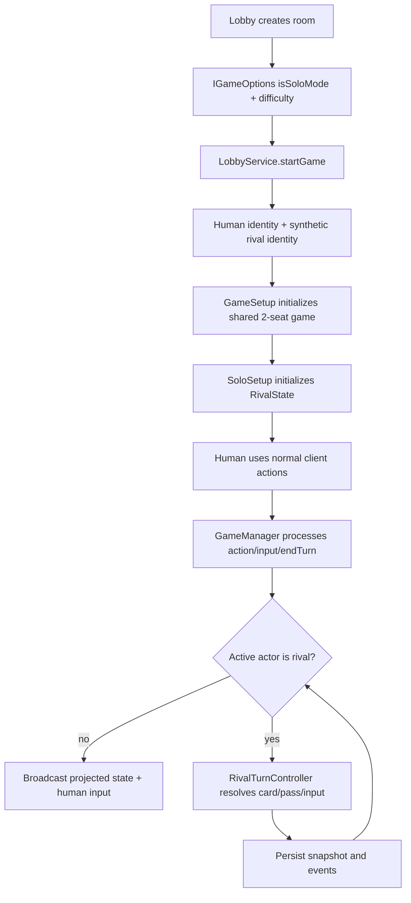

# Solo / Rival Architecture Design

> Scope: this document designs the implementation architecture for the solo
> rival mode described in `docs/arch/solo/README.md` and
> `docs/arch/solo/frontend-reference-data.md`.
>
> Decision: implement solo as a normal 2-seat rules game with one human player
> and one server-controlled rival actor. Use `isSoloMode` as the mode flag, but
> keep the current multiplayer `Game` aggregate, board model, scoring model,
> serialization flow, and client projection model.

## 1. Goals

- Reuse the existing multiplayer engine wherever the rule is actually shared:
  turn phases, score/publicity, solar system, planetary board, sectors, tech
  board inventory, alien discovery, milestones, final scoring, event log,
  snapshots, and protocol projection.
- Keep solo-only behavior inside explicit solo/rival modules, not scattered
  behind `if (isSoloMode)` checks in every action.
- Preserve multiplayer compatibility. Existing 2-4 player games and old
  snapshots should continue to load without solo fields.
- Make difficulty, rival board config, rival action cards, objectives, and alien
  special cards data-driven enough to extend.
- Keep the client render-only for rival logic. The server owns every rival
  decision and mutation.

Non-goals for the first implementation:

- Do not create a separate `SoloGame` engine.
- Do not use the debug bot system as the rival AI.
- Do not mix rival action cards into the normal `mainDeck`, `cardRow`, or
  player hand card registry.
- Do not make the rival a real authenticated user or require a DB row in
  `game_players`.

## 2. Core Decision

Use this shape:

```ts
interface IGameOptions {
  playerCount: number;        // rules seats; solo forces this to 2
  isSoloMode?: boolean;       // default false
  soloDifficulty?: 1 | 2 | 3 | 4 | 5;
  // existing fields...
}
```

In solo mode:

- `Game.players` contains two `Player` objects: the human and a synthetic rival.
- The rival `Player` keeps shared, public, player-like state: `score`,
  `publicity`, pieces, tech ids, traces, `passed`, and board occupancy.
- `Game.rivalState` keeps solo-only state: progress track,
  rival action deck, advanced reserve, species special cards, rival computer,
  objective stack/row/completed pile, current decision direction, and difficulty
  config.
- `GameManager` advances server-controlled rival turns until the next human
  boundary.

This gives the shared engine a real second actor for all systems that already
expect `playerId`, while keeping the simplified rival rules out of normal
`Player` resources and card-hand behavior.

## 3. Tradeoffs Considered

### Separate `SoloGame`

Rejected. It would duplicate `GameSetup`, phase transitions, scoring,
serialization, projection, and many board APIs. It would be faster to prototype
but harder to keep compatible with future multiplayer rule fixes.

### Debug Bot as Rival

Rejected. `GameGateway.runDebugBots` picks random legal multiplayer actions.
The rival is not a generic player AI. It has a fixed action deck, progress
conversion, special tech usage, objectives, and species replacement rules.

### `Player` Subclass Only

Not enough by itself. Existing `Player` is useful as a board/scoring identity,
but the rival does not have normal resources, hand, income, card choices, or
tech abilities. A `Player` proxy plus separate `RivalState` keeps the shared
identity and avoids stuffing solo-only data into normal player fields.

## 4. High-Level Flow



The important boundary: the rival loop lives in server application logic
(`GameManager`), not in the browser and not in the generic websocket gateway.

## 5. Package Responsibilities

### `packages/common`

Add solo data and protocol types that are shared by server tests and client
rendering:

- `constant/solo.ts`
  - difficulty config
  - rival board config
  - progress-track preferred tech order
  - rival computer slot rewards
  - objective stack composition
- `data/rivalActionCards.ts`
  - `RivalActionCardDefinition[]`
  - basic, advanced, and species special cards
- `data/rivalObjectives.ts`
  - `RivalObjectiveDefinition[]`
  - objective task definitions and levels
- `types/protocol/solo.ts`
  - `ESoloDifficulty`
  - `ERivalActionCardTier`
  - `ERivalDecisionDirection`
  - `ERivalActionKind`
  - public `IPublicRivalState`
- `types/protocol/gameState.ts`
  - optional `isSoloMode?: boolean`
  - optional `rival?: IPublicRivalState`
  - optional player marker such as `actorType?: 'human' | 'rival'`

Keep these types typed and narrow. Do not port untyped `frontend-reference`
`deckData` bags directly.

### `packages/server`

Add a solo engine folder:

```text
packages/server/src/engine/solo/
  RivalState.ts
  RivalSetup.ts
  RivalTurnController.ts
  RivalActionResolver.ts
  RivalAutomatedInputResolver.ts
  RivalResourceResolver.ts
  RivalTechResolver.ts
  RivalProbeResolver.ts
  RivalTelescopeResolver.ts
  RivalObjectiveTracker.ts
  RivalAlienSpecialResolver.ts
```

Server owns all rival logic:

- creating the synthetic rival
- initializing `RivalState`
- drawing and discarding rival action cards
- selecting the first possible action candidate
- resolving rival resources and progress conversion
- resolving objectives and penalties
- resolving automated inputs generated by shared systems
- adding objective VP before final scoring

### `packages/client`

Client changes should be rendering and room configuration only:

- create room: add Solo mode toggle and difficulty selector
- lobby/room: use `isSoloMode` to require one human player, while the game still
  starts as a 2-seat rules game internally
- game UI: show the rival as an opponent/automated actor, not a joinable user
- render `gameState.rival` for progress, action deck count, objectives, and
  rival board/computer
- use existing icon rendering (`DescRender` / `EffectFactory`) for objective,
  reward, trace, tech, and action-card icons

The client must not choose rival actions or infer rival deck/order.

## 6. Room and Option Compatibility

Keep `playerCount` as the rules seat count. In solo, it should be `2` because
the rulebook says solo is set up as a 2-player game.

Add helpers:

```ts
function isSoloMode(options: IGameOptions): boolean;
function getRequiredHumanPlayers(options: IGameOptions): number; // solo -> 1
function getRulesPlayerCount(options: IGameOptions): number;    // solo -> 2
```

Server lobby behavior:

- `createRoom`: accepts `options.isSoloMode` and `options.soloDifficulty`.
- `joinRoom`: rejects additional joins when `isSoloMode` and one human is
  already seated.
- `startGame`: allows start when `getRequiredHumanPlayers(options)` humans are
  present.
- synthetic rival identity is created at start time, not inserted into
  `game_players`.
- `Game.create` receives `[humanIdentity, rivalIdentity]` and options with
  `playerCount: 2`.

Client lobby behavior:

- room fullness and empty slots use `getRequiredHumanPlayers`, not raw
  `options.playerCount`.
- settings readout can show `Mode: Solo` and `Difficulty: ★★★`, while
  `playerCount` can remain a technical rules value.

This avoids changing the meaning of `playerCount` for existing multiplayer
games.

## 7. Domain Model

### Rival Identity

Use a stable synthetic id, for example:

```ts
const rivalId = `rival:${gameId}`;
```

The rival identity should have:

- `seatIndex: 1`
- a normal color from the existing color palette
- `actorType: 'rival'`
- display name such as `Rival Institution`

The rival id appears in board occupants, sectors, milestones, events, and final
scores. It must never be accepted as an authenticated socket user id.

### `RivalState`

Suggested internal state:

```ts
interface IRivalState {
  rivalPlayerId: string;
  difficulty: ESoloDifficulty;
  progress: number;
  progressSlot: number;
  boardConfigId: string;

  actionDeck: Deck<RivalActionCardId>;
  advancedReserve: Deck<RivalActionCardId>;
  removedActionCardIds: RivalActionCardId[];
  speciesSpecialCards: Partial<Record<EAlienType, RivalActionCardId>>;
  usedActionCardIdsThisRound: RivalActionCardId[];

  computer: {
    filledSlots: boolean[];
    dataPool: number;
  };

  objectives: {
    drawPile: RivalObjectiveId[];
    revealed: RivalObjectiveRuntime[];
    completed: RivalObjectiveRuntime[];
  };

  currentDecisionDirection?: ERivalDecisionDirection;
  currentActionCardId?: RivalActionCardId;
}
```

Keep normal `Player.score`, `Player.publicity`, `Player.techs`,
`Player.pieces`, `Player.traces`, and board occupants on the existing `Player`.
Keep progress, action deck, objective state, and rival computer in
`RivalState`.

## 8. Reuse Matrix

| Existing system | Reuse strategy |
| --- | --- |
| `Game` phase machine | Reuse. Rival turns enter the same `AWAIT_MAIN_ACTION`, `IN_RESOLUTION`, `AWAIT_END_TURN`, `BETWEEN_TURNS` phases. |
| `Player` | Reuse as rival identity and shared board/scoring holder. Skip human setup and normal hand/resources for `actorType: 'rival'`. |
| `Deck<T>` | Reuse for rival action deck and advanced reserve. Do not use `drawWithReshuffle` mid-round. |
| `SolarSystem` | Reuse for probe placement, reachability, rotation, sector lookup, and Oumuamua/anomaly tokens. |
| `PlanetaryBoard` | Reuse low-level `orbit`/`land` state mutations and slot availability. Rival resolver applies solo reward conversion. |
| `Sector` | Reuse `markSignal`, fulfillment, winner logic, and sector reset. Rival telescope chooses targets before calling shared APIs. |
| `TechBoard` | Reuse stack inventory and first-take VP. Rival tech resolver must apply rival-specific bonus conversion instead of normal tech abilities. |
| `AlienState` | Reuse discovery boards and trace slots. Add automated placement/input strategy for rival trace choices. |
| `MilestoneState` | Reuse neutral milestone checks. Rival gold claim needs automated first-slot behavior and final scoring must ignore rival gold tile score. |
| `FinalScoring` | Reuse human scoring. In solo, add objective VP to rival and set rival gold tile contribution to 0. |
| `GameSerializer` / `GameDeserializer` | Extend with optional `rivalState`; absence means multiplayer or older snapshot. |
| `projectGameState` | Extend with optional public rival projection. Do not expose hidden deck order. |

## 9. Setup Design

`GameSetup.initialize` should still initialize the shared board/deck/alien
systems once. Then branch only at the actor setup boundary:

1. Build solar system, sectors, planetary board, tech board, main deck, card row,
   end-of-round stacks, aliens, neutral milestones, gold tiles as today.
2. For human players, keep current corporation/start tuck setup.
3. For the rival player:
   - no starting corporation
   - no starting hand
   - no starting credits, energy, normal data pool, or income
   - publicity starts at 4
   - pieces are normal because board occupancy uses existing inventory
   - `pendingSetupTucks = 0`
4. `RivalSetup.initialize(game)` creates `game.rivalState`.
5. Randomize starting player between human and rival for solo, then assign
   starting VP: first player 1 VP, other player 2 VP.

The `Game.create` player-count assertion remains useful. In solo, the caller
passes two identities, not one.

## 10. Rival Turn Automation

Add a server-only automation boundary in `GameManager`, not `GameGateway`.

Suggested shape:

```ts
async function runAutomatedActorsUntilHumanBoundary(gameId: string): Promise<void> {
  for (let step = 0; step < MAX_SOLO_AUTOMATION_STEPS; step += 1) {
    const game = await getGame(gameId);
    if (!game.options.isSoloMode) return;
    if (!isRivalActive(game)) return;

    const turnIndexBefore = game.turnIndex;

    if (game.activePlayer.waitingFor) {
      const response = RivalAutomatedInputResolver.resolve(game);
      game.processInput(game.activePlayer.id, response);
    } else if (game.phase === EPhase.AWAIT_END_TURN) {
      game.processEndTurn(game.activePlayer.id);
    } else if (game.phase === EPhase.AWAIT_MAIN_ACTION) {
      RivalTurnController.takeTurn(game);
    } else {
      return;
    }

    persistSnapshot(...);
    await afterTurnMaybeChanged(gameId, game, turnIndexBefore);
  }
}
```

Run this after:

- human main action
- human free action if it can advance the turn
- human input response
- human end turn
- room join or reconnect if a saved game is stranded on a rival boundary

Stop when:

- active player is human
- a human `PlayerInput` is pending
- phase is `GAME_OVER`
- max automation step guard is reached

The max-step guard should throw/log loudly in tests. It indicates a rival
resolver loop, not normal gameplay.

## 11. Rival Action Resolution

### Card Draw and Candidate Selection

`RivalTurnController.takeTurn(game)`:

1. If action draw pile is empty, call `RivalPassResolver.pass(game)`.
2. Draw the top rival action card.
3. Store its id and `decisionDirection` in `RivalState`.
4. Iterate candidates in order.
5. Resolve the first possible candidate.
6. Move the used card to round discard unless species replacement removed it.
7. End the rival turn.

Each candidate should have:

```ts
type RivalActionCandidateDefinition =
  | { kind: 'analyze'; rewards: RivalReward[] }
  | { kind: 'launch'; rewards: RivalReward[] }
  | { kind: 'tech'; paid: boolean; rewards: RivalReward[] }
  | { kind: 'probe'; moves: number; planets: EPlanet[]; placementPriority: 'orbiter' | 'lander'; flags?: RivalProbeFlag[] }
  | { kind: 'telescope'; mode: 'default' | 'earth' | 'oumuamua' }
  | { kind: 'life'; speciesSlotIndex: number }
  | { kind: 'trace'; alienType?: EAlienType }
  | { kind: 'special'; specialKind: RivalSpecialKind };
```

`canResolve` and `resolve` should live together per action kind so tests can
lock both legality and mutation.

### Resource Conversion

All rival reward application goes through `RivalResourceResolver`.

Rules:

- VP adds to `rivalPlayer.score`.
- publicity adds to `rivalPlayer.publicity`.
- credits, energy, cards, and card-income rewards convert to progress.
- income increase converts to 4 progress.
- data fills rival computer immediately, then overflows into rival data pool.
- computer slot rewards resolve when the slot is filled.
- progress crossing the advanced-card icon adds one random advanced action card
  to the top of the rival action draw pile.

Do not call generic reward helpers that assume a human hand/resource economy
unless they are explicitly safe for the rival.

### Tech

Use `TechBoard.take` to remove a real tile from the shared board and preserve
first-take VP. Do not call `ResearchTechEffect.acquireTech` directly for rival
tech because it applies normal tech abilities and human computer placement.

`RivalTechResolver` should:

1. rotate the solar system unless the rule says otherwise
2. choose preferred tech from board config and progress slot
3. take the tile from `TechBoard`
4. add the tech id to `rivalPlayer.techs`
5. add first-take VP to rival score
6. apply printed tile bonuses through `RivalResourceResolver`
7. ignore Probe Launch and 2 Data tech bonuses per solo rule
8. store tech type for later discard by probe/telescope/analyze rules

### Probe, Orbit, and Land

Use shared board topology, but not the costed multiplayer action classes.

Recommended split:

- `RivalProbeResolver.launch` uses `LaunchProbeEffect.execute` if the rival has
  no probe in play and the effect remains cost-free. It should enforce the solo
  one-probe rule.
- `RivalProbeResolver.findPathToPlanet` uses `SolarSystem` adjacency and normal
  movement cost, including asteroid leaving cost.
- `RivalProbeResolver.placeAtPlanet` calls lower-level `PlanetaryBoard.orbit` or
  `PlanetaryBoard.land`, then applies the resulting rewards through
  `RivalResourceResolver`.
- If a probe/orange tech is discarded for a moon, remove one matching tech from
  rival owned techs and the rival state, then land on the moon if available.

### Telescope

`RivalTelescopeResolver` should own:

- card-row side choice from `decisionDirection`
- card discard and refill
- Earth-sector signal placement
- optional Oumuamua-tile signal placement
- extra card-row signal from discarded scan/red tech
- sector priority: win sector, score second slot, most existing rival markers,
  then largest sector

Signal placement uses `Sector.markSignal(rivalId)`. Fulfillment continues to use
the existing `ResolveSectorCompletion` path.

### Life Trace and Alien Discovery

Prefer an automated trace placement strategy over duplicating alien slot logic.

Add a rival trace helper that can choose a concrete slot by solo priority:

1. lowest available slot in the requested trace column
2. avoid overflow unless all non-overflow slots are unavailable
3. tie break with current `decisionDirection`
4. execute slot rewards through `RivalResourceResolver`

For discovery, keep `AlienState.discoverAlien` and alien plugins as the shared
source of board initialization. Where plugins currently assume human rewards
or `PlayerInput`, add a small automated resolver path for rival-owned prompts
instead of branching inside every plugin.

### Analyze

`RivalAnalyzeResolver` is possible only when the rival computer is full.

Resolution:

1. clear rival computer slots
2. apply action-card printed rewards
3. mark the rival board's blue trace
4. refill computer from rival data pool immediately
5. discard one computer/blue tech if available for 3 VP and 1 progress

The rival data pool is separate from `Player.dataPool`; keep it in
`RivalState`.

### Passing and Round Reset

`RivalPassResolver` should:

1. remove the top card from `game.endOfRoundStacks[currentIndex]`
2. add 1 progress
3. rotate the solar system if rival is first to pass this round
4. set `rivalPlayer.passed = true`

At round transition:

- shuffle used/revealed rival action cards back into the action draw pile
- do not return cards removed by species replacement
- refresh objective payment before normal income
- clear current rival card/decision context

This can be implemented by adding a solo hook inside `Game.resolveEndOfRound`
or by extracting end-of-round hooks into a small `GameModeHooks` object.

## 12. Automated Input Resolver

Some reused systems return `PlayerInput`, for example:

- `SelectGoldTile` for gold milestone claims
- `SelectOption` for trace slot choices
- sector fulfillment order when multiple sectors fulfill
- alien plugin choices

For a rival player, no socket will answer those prompts. Add
`RivalAutomatedInputResolver` that converts `IPlayerInputModel` to
`IInputResponse` using solo priorities.

Examples:

- `GOLD_TILE`: choose only a tile whose first slot is still available; choose
  left/right by current decision direction; final scoring ignores rival gold
  tile points.
- `OPTION` trace slot: choose by lowest-slot priority and direction tie break.
- `OPTION` sector fulfillment: choose the sector most favorable to the rival;
  if tied, use direction.
- `CARD` or `END_OF_ROUND`: only valid when a solo rule explicitly asks for it;
  otherwise throw in tests to avoid accidental human-hand behavior.

This keeps existing `PlayerInput`/`DeferredAction` continuation flow intact.

## 13. Objectives

Add `RivalObjectiveTracker` rather than treating objectives as missions.
Objectives are solo-only and have different timing:

- revealed row of up to 3 objectives
- completed pile for the human
- one marker per trigger
- refresh at end of human turn
- between-round payment after rounds 1-4
- uncompleted objective VP to rival at game end

The tracker should subscribe to or be called from existing mission/event
boundaries:

- score reaches threshold
- publicity reaches threshold
- data pool reaches threshold
- probe visits asteroid/comet
- card played with exact cost
- mission completed

Implementation option:

- record richer `MissionTracker`/event log events where needed
- then let `RivalObjectiveTracker.checkTriggers(game, event)` update objective
  tasks

Keep objective state in `RivalState`, because it is solo-only and should not
pollute normal mission state.

## 14. Persistence

Extend DTOs with optional solo fields:

```ts
interface IGameStateDto {
  // existing fields...
  rivalState?: IRivalStateDto;
}
```

Rules:

- if `rivalState` is absent, deserialize as normal multiplayer
- if `options.isSoloMode` is true and `rivalState` is absent, initialize a safe
  default only for controlled migrations/tests; production snapshots should
  include it
- serialize only public-safe runtime ids and deck order in snapshots; projection
  will hide deck order from clients
- persist rival player in `players` inside snapshot, because board/scoring state
  references the rival `playerId`

No required DB schema migration is needed for room options because `games.options`
is JSONB. A schema migration is only needed if the product wants queryable solo
metadata outside options.

## 15. Public Projection

Add optional public state:

```ts
interface IPublicGameState {
  isSoloMode?: boolean;
  rival?: IPublicRivalState;
}

interface IPublicRivalState {
  playerId: string;
  difficulty: ESoloDifficulty;
  progress: number;
  progressSlot: number;
  actionDeckSize: number;
  advancedReserveSize: number;
  usedActionCardCount: number;
  currentActionCardId?: string;
  computer: { filledSlots: boolean[]; dataPool: number };
  objectives?: {
    revealed: IPublicRivalObjective[];
    completedCount: number;
    drawPileSize: number;
  };
}
```

Do not expose:

- rival draw pile order
- advanced reserve order
- hidden objective stack order
- hidden species card reserve state beyond public counts

`IPublicPlayerState` should also mark the rival with `actorType: 'rival'` so
client components can avoid showing irrelevant hand/resource affordances.

## 16. Final Scoring

In `Game.resolveEndOfRound`, before calling `FinalScoring.score` after round 5:

1. `RivalObjectiveTracker.applyEndGameObjectiveVp(game)` adds 5 VP per
   uncompleted objective to the rival.
2. `FinalScoring.score` scores the human normally.
3. For the rival:
   - keep current VP
   - include alien penalties/bonuses only if the alien rule applies to the rival
   - set gold tile scoring contribution to 0
   - do not score end-game cards

Then winner calculation follows solo rule:

- human wins only if human final score is strictly greater than rival final
  score
- ties are rival wins

This may require a solo-specific winner override after `FinalScoring.score`,
because the current generic scorer treats equal highest score as shared winners.

## 17. Compatibility Rules

- `isSoloMode` defaults to `false`.
- all protocol additions are optional.
- existing multiplayer room creation should keep `playerCount` validation 2-4.
- solo room creation still stores `playerCount: 2` internally, while room UI
  uses one required human seat.
- existing snapshots without `rivalState` load unchanged.
- debug bot logic remains debug-only and must not run for solo rival.
- undo should be available only on human turn boundaries. Rival automated
  actions should lock or refresh checkpoints so the human cannot undo into the
  middle of a rival turn.
- event log should emit rival actions with the rival `playerId`, so replay and
  snapshots remain auditable.

## 18. Extension Points

### Difficulty

Difficulty should be pure config:

- initial progress
- board asset/config id
- objective stack composition
- starting advanced action cards
- preferred tech rotation
- computer slot rewards

Adding a difficulty should not require changing `RivalTurnController`.

### Action Cards

Action cards should be typed data plus resolver functions by candidate kind.
Adding a card should normally require:

1. add `RivalActionCardDefinition`
2. add or reuse candidate resolver
3. add unit tests for candidate legality and mutation

### Species Specials

Use a registry similar to the existing alien plugin pattern:

```ts
interface IRivalAlienSpecialResolver {
  canResolve(game: Game, card: RivalActionCardDefinition): boolean;
  resolve(game: Game, card: RivalActionCardDefinition): void | PlayerInput;
}
```

Register by `EAlienType`. This keeps Mascamites, Oumuamua, Anomalies,
Centaurians, and Exertians special behavior isolated.

## 19. Suggested Implementation Stages

1. Options and lobby
   - add `isSoloMode`, `soloDifficulty`
   - allow one-human solo room start
   - generate synthetic rival identity
   - tests: `GameOptions`, `LobbyService`

2. Setup and persistence
   - add `RivalState`, `RivalSetup`, DTO serialization
  - ensure existing multiplayer snapshots still load
   - tests: `GameSetup`, serializer/deserializer

3. Automation loop
   - add `GameManager` rival auto-advance
   - add automated input resolver skeleton
   - tests: active rival turn advances back to human without socket input

4. Core rival actions
   - pass, launch, tech, probe/orbit/land, telescope, analyze
   - tests per resolver plus integration turn-flow tests

5. Objectives and final scoring
   - objective task tracker
   - between-round payment
   - end-game uncompleted objective VP
   - strict human-win condition

6. Species specials
   - implement special replacement and per-species resolver registry
   - tests against `docs/arch/solo/frontend-reference-data.md`

7. Client projection and UI
   - render rival state and objective row
   - hide irrelevant rival hand/resource actions
   - Playwright smoke: create solo room, start, play human turn, observe rival
     auto turn, observe objective/rival panel

## 20. Test Matrix

Server unit tests:

- `GameOptions`: default false, solo difficulty validation, solo forces rules
  player count 2
- `GameSetup`: rival has no hand/corp/setup tucks; human setup still works
- `RivalSetup`: difficulty config, progress, action deck, objective stack
- `RivalResourceResolver`: conversions, data computer fill, progress crossing
- `RivalTechResolver`: preferred tech, first-take VP, ignored bonuses
- `RivalActionResolver`: first possible candidate selection
- `RivalPassResolver`: top EOR card removal, progress, first-pass rotation
- `RivalObjectiveTracker`: trigger, one marker per trigger, refresh/payment
- `FinalScoring`: rival gold tile score 0, tie is rival win

Integration tests:

- solo game starts with one human plus synthetic rival
- human end turn causes rival action and returns to human
- rival empty deck passes and round transition reshuffles used cards
- rival telescope can fulfill sectors and trigger shared sector resolution
- rival trace can discover an alien via shared `AlienState`
- old multiplayer snapshot without `rivalState` deserializes unchanged

Client tests:

- create-room dialog can choose Solo and difficulty
- room page shows one required human slot in solo
- game state renders rival as automated opponent
- rival objectives/rewards use existing desc/icon rendering

E2E:

- create solo room, start with one user, finish a human turn, verify rival turn
  auto-resolves and the active turn returns to the human
- run a deterministic seed where rival passes and round transition occurs
- run a deterministic seed where rival marks a trace and contributes to alien
  discovery

## 21. Success Criteria

The architecture is implemented correctly when:

- multiplayer tests still pass without solo-specific branches affecting them
- solo can be started with one authenticated human and no second websocket user
- the rival can take full turns using only server-side rules
- shared board/scoring systems see the rival as a valid player id
- client renders rival state from protocol only
- snapshots/undo/reconnect do not strand the game on a rival prompt
- adding a new rival action card or difficulty is mostly data plus a focused
  resolver test
