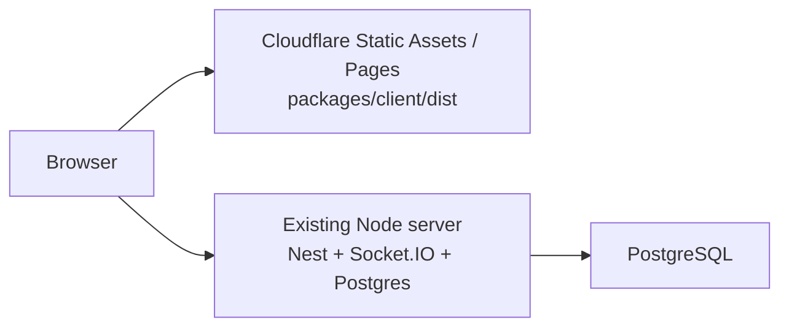
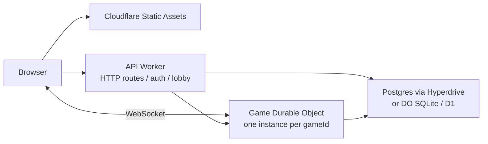

# Cloudflare Workers 接入评估

## 结论

当前项目可以先把 `packages/client` 接入 Cloudflare 静态托管；`packages/server` 不能原样运行在 Cloudflare Workers runtime 中。

更精确地说：

- Client：可以部署到 Cloudflare Workers Static Assets 或 Cloudflare Pages。现有 Vite SPA 构建产物是静态文件，API/WS 地址已经通过 `VITE_API_URL` / `VITE_WS_URL` 配置。
- Server：不建议尝试直接把现有 Nest + Express + Socket.IO + Node Postgres server 打包成 Worker。要跑在 Workers 上，需要重做 runtime 边界、WebSocket 协调和持久化适配。
- 最小可行路线：第一阶段只把 client 上 Cloudflare，server 继续作为 Node origin；第二阶段再按 per-game Durable Object 架构迁移 realtime/game runtime。

## 评估范围

本轮只评估 `server/client` 接入，不涉及 `packages/web` 的 Next 站点迁移。

依据：

- 本仓库当前代码与 package 配置。
- Cloudflare 官方文档：
  - [Workers Node.js compatibility](https://developers.cloudflare.com/workers/runtime-apis/nodejs/)
  - [Workers WebSockets](https://developers.cloudflare.com/workers/runtime-apis/websockets/)
  - [Durable Objects WebSockets](https://developers.cloudflare.com/durable-objects/best-practices/websockets/)
  - [Workers Static Assets](https://developers.cloudflare.com/workers/static-assets/)
  - [Workers PostgreSQL with Hyperdrive](https://developers.cloudflare.com/workers/tutorials/postgres/)
  - [Workers limits](https://developers.cloudflare.com/workers/platform/limits/)

## Client 可接入性

`packages/client` 当前是 Vite + React SPA：

- 构建脚本：`packages/client/package.json` 中 `build` 会同步 assets、跑 TypeScript、执行 `vite build`。
- 运行时配置：`packages/client/src/config/env.ts` 强制要求 `VITE_API_URL` 和 `VITE_WS_URL`。
- HTTP：`packages/client/src/api/httpClient.ts` 用 `VITE_API_URL` 作为 `axios` baseURL。
- Realtime：`packages/client/src/api/wsClient.ts` 用 `VITE_WS_URL` 创建 `socket.io-client` 连接。
- 静态资源：现有 `packages/client/dist` 约 24 MiB、170 个文件，最大单文件约 2.3 MiB，低于 Workers Static Assets 常见文件数量和单文件大小限制。

因此 client 可以直接走 Cloudflare 静态托管。需要新增的只是部署配置，例如：

```jsonc
{
  "name": "seti-client",
  "compatibility_date": "2026-05-09",
  "assets": {
    "directory": "./dist",
    "not_found_handling": "single-page-application"
  }
}
```

生产环境变量建议：

```bash
VITE_API_URL=https://api.example.com
VITE_WS_URL=https://api.example.com
VITE_ENABLE_DEBUG_ROUTES=false
```

如果后续 server realtime 改为原生 WebSocket，则 `VITE_WS_URL` 再改为 `wss://api.example.com/ws` 一类地址，并同步替换 client 的 Socket.IO 协议层。

## Server 当前阻塞点

### 1. 启动模型是 Node HTTP server

当前入口 `packages/server/src/main.ts`：

- `NestFactory.create(AppModule)`
- `app.useWebSocketAdapter(new IoAdapter(app))`
- `await app.listen(port)`

这套模型假设存在长期运行的 Node 进程和 HTTP server。Workers 的入口是 `fetch(request, env, ctx)`，即使启用 `nodejs_compat`，也不等于可以原样运行一个 Nest/Express listen server。

### 2. Realtime 使用 Socket.IO server

当前 gateway：

- `@nestjs/platform-socket.io`
- `@WebSocketGateway`
- `socket.io` 的 `Server` / `Socket`
- room adapter：`nsp.adapter.rooms`、`socket.join()`、`server.to(room).emit()`

Cloudflare Workers 支持 WebSocket，但多人游戏这种多连接协调需要单点协调。Cloudflare 官方建议用 Durable Objects 协调类似 chat room / multiplayer game 的连接和状态。当前 Socket.IO room adapter 与 Nest gateway 不能直接对应到 Durable Object 的 WebSocket API。

### 3. GameManager 依赖进程内状态

`packages/server/src/gateway/GameManager.ts` 有以下进程内状态：

- `cache = new Map<string, IGame>()`
- `versions = new Map<string, number>()`
- `timers = new Map<string, ReturnType<typeof setTimeout>>()`
- `turnCheckpoints = new Map<string, ITurnCheckpointInMemory>()`
- `UNLOAD_TIMEOUT_MS = 5 * 60 * 1000`

这些状态在单 Node 进程中合理，但不适合普通 Worker 多 isolate、按请求调度的运行模型。若迁移到 Workers，`gameId` 应映射到一个 Durable Object instance，由该 DO 负责：

- 接收该 game 的 WebSocket 连接。
- 持有当前 game 的热状态。
- 在 hibernation / eviction 后从持久化存储恢复。
- 串行处理该 game 的 action/input/undo。

### 4. 数据库层绑定 Node Postgres

当前 `DrizzleModule` 使用：

- `drizzle-orm/node-postgres`
- `pg.Pool`
- `DATABASE_URL`

Cloudflare Workers 可以通过 TCP sockets / Hyperdrive 连接 PostgreSQL，但代码需要改成从 `env.HYPERDRIVE.connectionString` 或 Worker secret/binding 获取连接信息，并控制连接生命周期。现有 Nest DI 中创建全局 `pg.Pool` 的方式不适合直接照搬。

如果选择 D1，则改造更大，因为当前 schema 使用 PostgreSQL 特性：

- `uuid`
- `jsonb`
- `timestamp withTimezone`
- `pgcrypto` migration
- Drizzle `pg-core`

D1 路线需要重新定义 schema、迁移 SQL、序列化 JSON 字段，并重跑 repository 测试。

### 5. Bundle 与 runtime 风险

Server 依赖 Nest、reflect-metadata、class-validator、Socket.IO、pg、drizzle-orm/node-postgres。Cloudflare Workers 的 Node.js compatibility 是子集支持，并且部分 API 是 stub/polyfill；即使某些模块能被打包，也不能保证其 server listen、Socket.IO adapter、连接池和 decorator runtime 行为符合生产需求。

Workers 还有 128 MB isolate memory 限制。当前游戏规则引擎和资源数据可以继续复用，但不应该把整套 Nest server、Socket.IO server 和所有 game cache 塞进普通 Worker isolate。

## 推荐架构

### 阶段 1：Client 上 Cloudflare，Server 保持 Node origin

这是成本最低、风险最低的接入方式。

架构：



改造项：

- 新增 client 的 Wrangler/Pages 配置。
- CI 构建时注入生产 `VITE_API_URL` / `VITE_WS_URL`。
- 给 server 配置 Cloudflare DNS / Tunnel / Load Balancer，确保 HTTPS 和 WebSocket upgrade 可用。
- 收紧 CORS：`CORS_ORIGIN` 不再使用 `*`，改为 client 正式域名。

验证：

- `pnpm --filter @seti/client build`
- 部署后访问 SPA 深链，例如 `/game/:id` 或 `/lobby`。
- 登录、创建房间、加入房间、启动游戏、Socket.IO action/input/undo 全流程 E2E。

### 阶段 2：抽出 Worker 友好的 API 边界

先不要迁移游戏实时运行时，先抽象边界：

- Repository 接口：把 `GameRepository` / `UserRepository` / `TurnCheckpointRepository` 从 `NodePgDatabase` 具体类型解耦。
- Auth service：把 JWT、密码哈希、用户查询与 Nest controller 解耦。
- DTO validation：把 Nest `ValidationPipe` 依赖下沉为 route 层行为，核心 service 使用显式 schema 或类型保护。
- Protocol contract：保留 common package 中 HTTP DTO 和 realtime event 的协议定义。

验证：

- server 现有 repository/auth/lobby 测试全部继续通过。
- 新增一个最小 Worker adapter 单测，证明 auth/lobby handler 可以在 `workerd` / Miniflare 环境跑。

### 阶段 3：Realtime/game runtime 迁移到 Durable Objects

目标架构：



设计要点：

- 一个 `gameId` 对应一个 Durable Object id。
- `GameDO` 替代 `GameGateway + GameManager` 的组合。
- `GameDO` 内部持有该局游戏的热状态和连接集合。
- 所有 `game:action` / `game:freeAction` / `game:input` / `game:undo` 在同一个 DO 中串行处理。
- 广播改为 DO 持有的 WebSocket 列表逐个发送。
- 客户端从 Socket.IO 切到原生 WebSocket message envelope，或引入 Workers 友好的 websocket client wrapper。
- hibernation 后不能依赖内存 Map；连接 attachment 和 game snapshot 必须可恢复。

建议协议 envelope：

```ts
type ClientMessage =
  | { type: 'room:join'; gameId: string }
  | { type: 'room:leave'; gameId: string }
  | { type: 'game:action'; gameId: string; action: IMainActionRequest }
  | { type: 'game:freeAction'; gameId: string; action: IFreeActionRequest }
  | { type: 'game:input'; gameId: string; inputResponse: IInputResponse }
  | { type: 'game:undo'; gameId: string };

type ServerMessage =
  | { type: 'game:state'; gameState: IPublicGameState }
  | { type: 'game:waiting'; playerId: string; input: IPlayerInputModel }
  | { type: 'game:event'; event: TGameEvent }
  | { type: 'game:error'; error: IErrorPayload }
  | { type: 'game:undoApplied'; payload: IUndoAppliedPayload };
```

### 阶段 4：数据库选择

推荐优先级：

1. 保留 PostgreSQL + Hyperdrive：改造较小，能复用现有 Drizzle schema 和 JSONB snapshots。
2. Durable Object SQLite 存每局热数据，Postgres 存账号/大厅/历史快照：适合 per-game 强一致状态，但需要设计跨 DO 查询。
3. 全量 D1：只有在明确要脱离 PostgreSQL 时考虑，schema 和 migration 成本最高。

对于当前项目，优先推荐 PostgreSQL + Hyperdrive。原因是游戏 snapshot 已经是 Postgres JSONB 模型，迁 D1 的收益不明显，改造面却很大。

## 改造清单

### Client

- 新增 Cloudflare 部署配置。
- 构建环境注入生产 API/WS URL。
- 如果 server 仍是 Node origin，`VITE_WS_URL` 保持 `https://api.example.com`，继续使用 Socket.IO。
- 如果 server 改为 Durable Object WebSocket，替换 `packages/client/src/api/wsClient.ts`，保留对外方法名以降低页面改动。

### Server

- 新增 `packages/worker-api` 或 `packages/server-worker`，不要直接改写现有 Node server。
- 抽出纯 service/repository port，保留现有 Nest server 作为 adapter。
- 替换 HTTP adapter：Nest controller -> Worker fetch router。
- 替换 realtime adapter：Socket.IO gateway -> Durable Object WebSocket。
- 替换 persistence adapter：`pg.Pool` 全局连接池 -> Hyperdrive/Worker env binding。
- 把 `GameManager` 的 per-game 内存状态迁入 `GameDO`。
- 给 DO hibernation/cold-load 增加 snapshot restore 测试。
- 禁用或隔离 debug bot/debug replay 中不适合边缘生产的能力。

## 风险

- Socket.IO 协议迁移会触及 client/server realtime 协议，需要 E2E 覆盖真实游戏动作。
- Durable Object hibernation 会重置内存状态，undo checkpoint 和 socket identity 不能只放 Map。
- Worker bundle 大小和启动时间需要实际打包验证，Nest/Socket.IO 依赖不应进入最终 Worker bundle。
- Postgres 写入频率可能因 game snapshot 变多而增加，需要重新评估快照策略和 Hyperdrive 连接行为。
- Workers 免费层 CPU 时间偏紧，完整规则结算建议按付费 Workers 或 Durable Objects 的实际限制做压测。

## 建议实施顺序

1. 先做 client Cloudflare 静态部署 POC。
2. 给现有 Node server 挂 Cloudflare 域名，保持 Socket.IO 生产可用。
3. 抽象 repository/auth/lobby service port，不改变现有行为。
4. 新建最小 Worker API，仅实现 `/health` 和一个只读 lobby endpoint。
5. 新建 `GameDO` spike，只承载一个 mock game room 的 WebSocket join/broadcast。
6. 把真实 `GameManager` 的 `getGame`、`processAction`、`buildResult` 移入 `GameDO`。
7. 替换 client `wsClient` 协议层，跑 login/lobby/game E2E。
8. 评估是否继续迁移 auth/lobby 写路径，或长期保留 Node server + Cloudflare front door。

## 验收标准

Client POC：

- Cloudflare 域名可访问 SPA。
- 深链刷新返回 `index.html`。
- 静态 assets 全部 200。
- 登录、房间列表、创建房间、加入房间可访问 Node API。
- 游戏内 Socket.IO 连接、action/input/undo 正常。

Full Worker POC：

- 不依赖 Nest `app.listen`。
- 不依赖 Socket.IO server。
- 每个 gameId 的 realtime 消息进入同一个 Durable Object。
- DO cold start / hibernation 后能恢复 game state。
- Postgres/Hyperdrive 或 DO storage 写入通过集成测试。
- 现有 server/client/e2e 关键流程通过。
